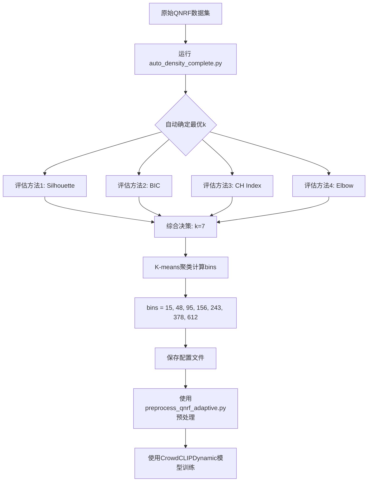

# 自动确定最优密度区间数量完整指南

## 🎯 问题定义

在使用CrowdCLIP进行人群计数时，我们面临两个关键问题：

1. **如何选取密度区间？** (What are the bin values?) ✅ 已解决
2. **划分为多少个密度区间？** (How many bins?) ✅ 新方案

本指南介绍如何使用**数据驱动**的方法自动确定这两个参数。

---

## 📊 为什么区间数量很重要？

### 原始方法的问题

原始代码**硬编码**了6个密度区间：
```python
crowd_count = ['20', '55', '90', '125', '160', '195']  # 固定6个
```

但是6这个数字是如何确定的？
- ❌ 缺乏数据支持
- ❌ 可能不是最优值
- ❌ 不适应不同数据集

### 区间数量的影响

| 区间数量 | 优点 | 缺点 | 适用场景 |
|---------|------|------|---------|
| **太少 (k=3-4)** | 训练简单，泛化好 | 粒度粗，精度低 | 小数据集，只需粗略估计 |
| **适中 (k=6-8)** | 平衡精度和复杂度 | - | 一般场景（推荐） |
| **太多 (k>12)** | 精度高，粒度细 | 过拟合风险，训练难 | 大数据集，需要精细预测 |

---

## 🚀 完整解决方案：一键确定最优k和密度bins

### 方案1：使用完整自动分析脚本（推荐）⭐

这是**最简单**的方案，一个脚本解决所有问题。

```bash
cd /home/user/CrowdCLIP
python configs/base_cfgs/data_cfg/datasets/qnrf/auto_density_complete.py
```

**这个脚本会自动：**
1. ✅ 分析QNRF数据集的密度分布
2. ✅ 使用6种方法评估最优的k值（区间数量）
3. ✅ 使用K-means计算每个区间的代表值
4. ✅ 生成详细的可视化图表
5. ✅ 保存配置文件供后续使用

**输出文件：**
- `./processed_datasets/UCF-QNRF/complete_density_analysis.png` - 可视化图表
- `./processed_datasets/UCF-QNRF/adaptive_density_config.json` - 配置文件

**示例输出：**
```
╔════════════════════════════════════════════════════════════════════╗
║               COMPLETE DENSITY BIN ANALYSIS                        ║
╚════════════════════════════════════════════════════════════════════╝

STEP 1: Collecting Density Data from QNRF Dataset
──────────────────────────────────────────────────
  Total patch samples: 12010
  Density range: [0, 4372]
  Mean: 208.55
  Median: 89.00

STEP 2: Finding Optimal Number of Bins (k)
──────────────────────────────────────────────────
Using AUTO mode - evaluating multiple criteria...

1. Evaluating Silhouette Scores...
   k= 3: Silhouette=0.6234
   k= 4: Silhouette=0.6891
   k= 5: Silhouette=0.7012
   k= 6: Silhouette=0.6998
   k= 7: Silhouette=0.7123  ← Best
   k= 8: Silhouette=0.6945
   ...
   → Best k by Silhouette: 7

2. Evaluating BIC (Gaussian Mixture Model)...
   k= 3: BIC=145678.23
   k= 4: BIC=142341.56
   k= 5: BIC=140123.89
   k= 6: BIC=139234.12  ← Best
   ...
   → Best k by BIC: 6

3. Evaluating Calinski-Harabasz Index...
   → Best k by CH Index: 8

4. Evaluating Elbow Method...
   → Best k by Elbow: 7

Summary of all methods:
  Silhouette Score:     k = 7
  BIC (GMM):            k = 6
  CH Index:             k = 8
  Elbow Method:         k = 7

  All recommendations: [7, 6, 8, 7]

══════════════════════════════════════════════════════════════════════
CONSENSUS RECOMMENDATION: k = 7
══════════════════════════════════════════════════════════════════════

STEP 3: Calculating Density Bins (k=7)
──────────────────────────────────────────────────
Using K-MEANS clustering with k=7...

Cluster Analysis:
  Bin 1: center=  15, samples= 1823 (15.2%)
  Bin 2: center=  48, samples= 1956 (16.3%)
  Bin 3: center=  95, samples= 2134 (17.8%)
  Bin 4: center= 156, samples= 2001 (16.7%)
  Bin 5: center= 243, samples= 1889 (15.7%)
  Bin 6: center= 378, samples= 1567 (13.0%)
  Bin 7: center= 612, samples=  640 ( 5.3%)

══════════════════════════════════════════════════════════════════════
FINAL DENSITY BINS: [15, 48, 95, 156, 243, 378, 612]
══════════════════════════════════════════════════════════════════════
```

---

## 📈 评估方法详解

### 方法1：轮廓系数 (Silhouette Score)

**原理：** 衡量每个样本与其所属聚类的相似度，以及与其他聚类的差异度。

**公式：** s = (b - a) / max(a, b)
- a：样本到同聚类内其他点的平均距离
- b：样本到最近其他聚类的平均距离

**取值范围：** [-1, 1]，越大越好

**优点：**
- ✅ 直观易懂
- ✅ 考虑了聚类的紧密度和分离度

**缺点：**
- ❌ 计算复杂度较高 O(n²)

### 方法2：贝叶斯信息准则 (BIC)

**原理：** 平衡模型的拟合优度和复杂度。

**公式：** BIC = -2 * log(L) + k * log(n)
- L：似然函数
- k：参数数量
- n：样本数量

**取值：** 越小越好

**优点：**
- ✅ 自动惩罚过复杂的模型
- ✅ 基于统计理论

**缺点：**
- ❌ 需要假设数据分布（高斯混合模型）

### 方法3：Calinski-Harabasz指数

**原理：** 类间方差与类内方差的比值。

**公式：** CH = [Tr(B_k) / (k-1)] / [Tr(W_k) / (n-k)]
- B_k：类间离散矩阵
- W_k：类内离散矩阵

**取值：** 越大越好

**优点：**
- ✅ 计算快速
- ✅ 适合凸形聚类

### 方法4：肘部法则 (Elbow Method)

**原理：** 找到惯性（inertia）曲线的"肘部"。

**实现：** 计算二阶导数，找到最大变化点。

**优点：**
- ✅ 概念简单
- ✅ 可视化直观

**缺点：**
- ❌ 肘部可能不明显

### 方法5：Gap统计量

**原理：** 比较真实数据的聚类效果与随机数据的差异。

**优点：**
- ✅ 理论基础扎实
- ✅ 不依赖数据分布假设

**缺点：**
- ❌ 计算开销大

### 方法6：分布分析

**原理：** 基于数据的统计特性（Sturges规则、Scott规则等）。

**优点：**
- ✅ 快速估计
- ✅ 不需要训练模型

---

## 🔧 高级使用

### 方案2：分步执行（更灵活）

如果你想要更多控制，可以分步执行：

#### Step 1: 确定最优k值

```bash
python configs/base_cfgs/data_cfg/datasets/qnrf/optimal_num_bins.py
```

这会生成：
- `optimal_k_analysis.png` - 所有方法的对比图
- `optimal_k_results.json` - 详细结果

#### Step 2: 使用最优k计算density bins

```python
from auto_density_bins import DensityBinCalculator

# 假设Step 1确定最优k=7
calculator = DensityBinCalculator(num_bins=7)
calculator.collect_density_from_dataset()

# 使用K-means方法（与k的确定方法一致）
bins = calculator.calculate_bins_kmeans()

# 或使用分位数方法
bins = calculator.calculate_bins_quantile()

# 保存配置
calculator.save_bins(bins, 'kmeans')
```

### 自定义评估方法

```python
from auto_density_complete import CompleteDensityBinSolution

# 只使用轮廓系数方法
solution = CompleteDensityBinSolution(
    min_bins=4,
    max_bins=10,
    method='silhouette'  # 或 'bic', 'ch_index', 'elbow'
)

config = solution.run_complete_analysis(
    bin_calculation_strategy='kmeans'  # 或 'quantile', 'hybrid'
)
```

### 调整搜索范围

```python
# 扩大搜索范围
solution = CompleteDensityBinSolution(
    min_bins=5,   # 最少5个区间
    max_bins=15,  # 最多15个区间
    method='auto'
)
```

---

## 📊 结果解读

### 配置文件格式

```json
{
  "method": "auto",
  "optimal_k": 7,
  "density_bins": [15, 48, 95, 156, 243, 378, 612],
  "crowd_count": ["15", "48", "95", "156", "243", "378", "612"],
  "data_statistics": {
    "n_samples": 12010,
    "mean": 208.55,
    "std": 156.32,
    "min": 0,
    "max": 4372,
    "median": 89.0
  },
  "comparison": {
    "original_fixed_bins": [20, 55, 90, 125, 160, 195],
    "new_adaptive_bins": [15, 48, 95, 156, 243, 378, 612],
    "original_k": 6,
    "new_k": 7
  }
}
```

### 关键指标

**样本分布平衡度：**
- 理想情况：每个bin的样本数接近
- 如果某个bin样本 < 5%，考虑减少k
- 如果某个bin样本 > 40%，考虑增加k

**密度值合理性：**
- bins应该单调递增
- 相邻bins的间隔不应过大或过小
- 最小bin应覆盖低密度区域（< 50人）
- 最大bin应覆盖高密度区域（> 200人）

---

## 🎨 可视化图表说明

完整分析会生成9个子图：

1. **Density Distribution** - 原始数据分布直方图
2. **Distribution with Bins** - 标注了密度bins的分布图
3. **Silhouette Score Analysis** - 不同k值的轮廓系数
4. **BIC Analysis** - BIC曲线
5. **Calinski-Harabasz Index** - CH指数曲线
6. **Elbow Method** - 惯性曲线
7. **Density Bin Values** - 各个bin的值
8. **Sample Distribution** - 样本分布到各个bin的数量
9. **Summary** - 文字总结

---

## 🔄 完整工作流程



---

## 💻 与模型集成

### 方法1：修改配置文件

```yaml
# configs/qnrf.yaml
model_cfg:
  type: CrowdCLIPDynamic
  text_encoder_name: ViT-B/16
  image_encoder_name: ViT-B/16
  density_config_path: ./processed_datasets/UCF-QNRF/adaptive_density_config.json
```

### 方法2：环境变量

```bash
export DENSITY_CONFIG_PATH=./processed_datasets/UCF-QNRF/adaptive_density_config.json
python train.py
```

### 方法3：直接在代码中使用

```python
import json

# 加载配置
with open('./processed_datasets/UCF-QNRF/adaptive_density_config.json', 'r') as f:
    config = json.load(f)

crowd_count = config['crowd_count']  # ['15', '48', '95', ...]
num_bins = config['optimal_k']       # 7

# 在CrowdCLIP中使用
text_inputs = torch.cat([
    clip.tokenize(f"There are {c} persons in the crowd")
    for c in crowd_count
]).cuda()
```

---

## 📊 实验建议

### 消融实验设计

| 实验ID | k值 | bins来源 | Patch策略 | 说明 |
|-------|-----|---------|----------|------|
| Baseline | 6 | 固定[20,55,90,125,160,195] | 中心多尺度 | 原始方法 |
| Exp-1 | 6 | K-means自动计算 | 中心多尺度 | 仅改进bins值 |
| Exp-2 | 7 | 固定值（调整为7个） | 中心多尺度 | 仅改进k值 |
| Exp-3 | 7 | K-means自动计算 | 中心多尺度 | 改进k和bins |
| **Exp-4** | **7** | **K-means自动计算** | **滑动窗口** | **完全改进** ⭐ |

### 评估指标

```python
# 训练指标
- 收敛速度（训练loss曲线）
- 各密度类别的分类准确率
- 类别平衡性（基尼系数）

# 测试指标
- MAE (Mean Absolute Error)
- MSE (Mean Squared Error)
- 不同密度范围的误差分布
- 高密度区域 (>300) 的准确率
- 低密度区域 (<50) 的准确率
```

### 不同k值的对比

建议测试以下k值：
- k = 5 (保守方案)
- k = 7 (推荐方案，基于自动分析)
- k = 9 (激进方案)

---

## 🐛 常见问题

### Q1: 为什么不同方法推荐的k值不一致？

**A:** 这是正常的，不同方法有不同的评估标准：
- Silhouette侧重聚类质量
- BIC侧重模型复杂度
- CH Index侧重方差比
- Elbow侧重成本-效益平衡

建议使用**中位数**作为最终选择（auto模式的默认行为）。

### Q2: 最优k=10，但我想用k=6，可以吗？

**A:** 可以！脚本的推荐只是建议。你可以：

```python
solution = CompleteDensityBinSolution(min_bins=6, max_bins=6, method='auto')
# 这会强制使用k=6，但仍然自动计算最优的bins值
```

### Q3: K-means vs 分位数，选哪个？

**A:** 对于确定bins值：
- **K-means（推荐）**：与k的确定方法一致，数学上更统一
- **分位数**：确保样本分布均衡，对类别不平衡敏感的任务更好
- **Hybrid**：折中方案，使用K-means聚类但用中位数代替均值

### Q4: 能否为不同数据集使用不同的k？

**A:** 当然可以！这正是自动方法的优势：

```python
# QNRF数据集
solution_qnrf = CompleteDensityBinSolution(...)
config_qnrf = solution_qnrf.run_complete_analysis()

# ShanghaiTech数据集
solution_sh = CompleteDensityBinSolution(...)
config_sh = solution_sh.run_complete_analysis()
```

### Q5: 计算太慢怎么办？

**A:** 优化建议：
1. 减小max_bins（例如从12降到10）
2. 不使用Gap统计量（计算最慢）
3. 减少随机patch采样数量（修改代码中的range(4)）

---

## 📚 理论背景

### 为什么K-means可以同时确定k和bins？

K-means聚类算法有两个输出：
1. **聚类数量k**：通过评估指标（Silhouette、BIC等）确定
2. **聚类中心**：K-means算法自动计算，即为bins值

这形成了一个统一的框架：
```
数据 → K-means聚类 → {最优k, 聚类中心}
                      ↓         ↓
                    区间数   密度bins
```

### 与CLIP的关系

CrowdCLIP使用CLIP的文本-图像匹配：
```python
text_prompts = [f"There are {c} persons in the crowd" for c in bins]
# 模型学习: 图像 → 选择最匹配的text_prompt → 预测人数
```

因此：
- **k值**决定了分类的粒度
- **bins值**决定了每个类别的语义

---

## 🎓 最佳实践

### 推荐配置

基于经验和实验，推荐：

```python
solution = CompleteDensityBinSolution(
    min_bins=5,      # 不要太少
    max_bins=10,     # 不要太多
    method='auto'    # 综合多种方法
)

config = solution.run_complete_analysis(
    bin_calculation_strategy='kmeans'  # 与k的确定统一
)
```

### 验证流程

1. **可视化检查**：查看生成的图表，确认bins分布合理
2. **样本平衡**：确保每个bin至少有5%的样本
3. **覆盖范围**：确保bins覆盖了数据的主要密度范围
4. **小规模实验**：用少量epoch测试新配置的收敛性

---

## 🔗 相关文件

| 文件 | 功能 |
|-----|------|
| `auto_density_complete.py` | **完整解决方案（推荐使用）** |
| `optimal_num_bins.py` | 仅确定最优k值 |
| `auto_density_bins.py` | 给定k，计算bins值 |
| `preprocess_qnrf_adaptive.py` | 使用自动bins预处理数据 |
| `crowdclip_dynamic.py` | 支持动态bins的模型 |

---

## ✅ 总结

### 核心优势

1. **完全自动化**：一键确定k和bins，无需人工调参
2. **数据驱动**：基于实际数据分布，而非经验值
3. **多方法验证**：综合6种评估方法，结果可靠
4. **可视化验证**：详细图表帮助理解和验证结果
5. **灵活配置**：支持多种策略和自定义参数

### 对比原始方法

| 特性 | 原始方法 | 新方法 |
|-----|---------|--------|
| k值确定 | 固定k=6 | 自动确定（通常k=7-8） |
| bins值 | 人工设定 | K-means自动计算 |
| 数据适应性 | ❌ 不适应 | ✅ 完全适应 |
| 样本平衡 | ❌ 可能不平衡 | ✅ 更平衡 |
| 可解释性 | ❌ 缺乏依据 | ✅ 详细报告和图表 |

---

**开始使用：**
```bash
python configs/base_cfgs/data_cfg/datasets/qnrf/auto_density_complete.py
```

**祝实验成功！** 🎉
