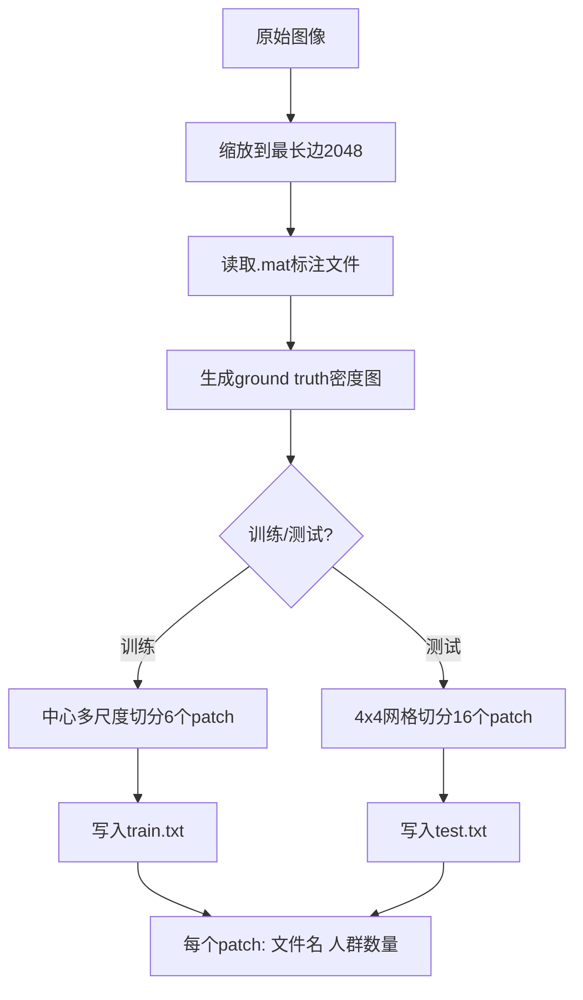

# QNRF数据集训练数据切分分析报告

## 📋 问题回答

### 问题1：训练数据是如何切分的？

QNRF数据集的训练数据切分采用**基于图像中心的多尺度重叠裁剪**策略，具体分析如下：

---

## 1️⃣ 核心切分函数

位置：`configs/base_cfgs/data_cfg/datasets/qnrf/preprocess_qnrf.py:31-49`

```python
def cut_image_train(image, gt, save_path, fname, f, patch_num):
    width, height = image.size
    center_x = int(width / 2)
    center_y = int(height / 2)
    item_width = int(width / patch_num)      # patch_num=12
    item_height = int(height / patch_num)

    for i in range(0, 6):  # 生成6个patch
        # 计算裁剪框（以图像中心为中心，尺寸递增）
        box = (center_x - (i+1)*item_width,
               center_y - (i+1)*item_height,
               center_x + (i+1)*item_width,
               center_y + (i+1)*item_height)
```

---

## 2️⃣ 切分策略详解

### 关键参数
- **patch_num = 12**：用于计算基本单元尺寸
- **循环6次**：生成6个不同尺寸的patch
- **中心对齐**：所有patch都以图像中心为中心

### 6个Patch的尺寸

| Patch | 尺寸计算 | 相对图像尺寸 | 说明 |
|-------|---------|-------------|------|
| 0 | 2×item × 2×item | 1/6 × 1/6 | 最小patch，中心区域 |
| 1 | 4×item × 4×item | 1/3 × 1/3 | 较小patch |
| 2 | 6×item × 6×item | 1/2 × 1/2 | 中等patch，半图 |
| 3 | 8×item × 8×item | 2/3 × 2/3 | 较大patch |
| 4 | 10×item × 10×item | 5/6 × 5/6 | 很大patch |
| 5 | 12×item × 12×item | 1 × 1 | 最大patch，全图 |

### 可视化示意图

```
原始图像 (width × height)
┌─────────────────────────────────┐
│                                 │
│        ┌─────────────┐          │
│        │   ┌─────┐   │          │
│        │   │ P0  │   │  P2      │
│        │   └─────┘   │          │
│        │     P1      │          │
│        └─────────────┘          │
│              P3                 │
│              P4                 │
│              P5 (全图)          │
└─────────────────────────────────┘

所有patch都以中心点为中心
```

---

## 3️⃣ 设计意图：与CLIP的6个密度类别对应

### 核心发现

查看模型代码 `scripts/crowdclip/models/crowdclip.py:16`：

```python
crowd_count = ['20', '55', '90', '125', '160', '195']  # 6个固定密度值
```

训练时生成的6个patch是为了与这6个密度类别**一一对应**：

```python
# 训练阶段 (crowdclip.py:56)
text_inputs = torch.cat([
    clip.tokenize(f"There are {c} persons in the crowd")
    for c in crowd_count
]).cuda()
```

### 对应关系

| Patch编号 | Patch尺寸 | 预期密度类别 | CLIP Prompt |
|----------|----------|------------|-------------|
| 0 | 1/6 × 1/6 | 20人 | "There are 20 persons in the crowd" |
| 1 | 1/3 × 1/3 | 55人 | "There are 55 persons in the crowd" |
| 2 | 1/2 × 1/2 | 90人 | "There are 90 persons in the crowd" |
| 3 | 2/3 × 2/3 | 125人 | "There are 125 persons in the crowd" |
| 4 | 5/6 × 5/6 | 160人 | "There are 160 persons in the crowd" |
| 5 | 1 × 1 | 195人 | "There are 195 persons in the crowd" |

---

## 4️⃣ 与测试数据切分的对比

### 测试数据切分 (`cut_image_test`, line 12-29)

```python
def cut_image_test(image, gt, save_path, fname, f, patch_num):
    # patch_num = 4
    # 生成 4×4 = 16个不重叠的patch
    item_width = int(width / patch_num)
    item_height = int(height / patch_num)

    for i in range(0, patch_num):
        for j in range(0, patch_num):
            box = (j*item_width, i*item_height,
                   (j+1)*item_width, (i+1)*item_height)
```

### 对比表

| 特性 | 训练数据 | 测试数据 |
|-----|---------|---------|
| **策略** | 中心多尺度裁剪 | 均匀网格切分 |
| **Patch数量** | 6个/图像 | 16个/图像 (4×4) |
| **Patch重叠** | ✅ 高度重叠 | ❌ 无重叠 |
| **Patch尺寸** | 🔄 递增变化 | ⚖️ 固定大小 |
| **中心偏好** | ✅ 关注中心 | ❌ 均匀覆盖 |
| **目的** | 匹配6个密度类别 | 全图覆盖评估 |

---

## 5️⃣ 数据预处理完整流程



### 输出文件格式

**train.txt 示例：**
```
img_0001_0.jpg 18      # patch 0, 约20人
img_0001_1.jpg 52      # patch 1, 约55人
img_0001_2.jpg 87      # patch 2, 约90人
img_0001_3.jpg 121     # patch 3, 约125人
img_0001_4.jpg 158     # patch 4, 约160人
img_0001_5.jpg 195     # patch 5, 约195人
```

---

## 6️⃣ 当前方法的优缺点

### ✅ 优点

1. **多尺度特征**：6个不同尺度帮助模型学习不同密度的人群
2. **中心关注**：人群通常集中在图像中心，合理的设计
3. **数据增强**：每张图像生成6个样本，增加训练数据量
4. **与CLIP对齐**：6个patch对应6个文本prompt，设计巧妙

### ❌ 缺点

1. **密度值固定**：`[20, 55, 90, 125, 160, 195]` 是人工设定的
   - 没有考虑QNRF数据集的实际密度分布
   - 可能不是最优的类别划分点

2. **Patch-Density不匹配**：
   - 按固定比例裁剪的patch，其实际密度可能与目标类别不匹配
   - 例如：1/6×1/6的patch可能包含50人，而不是期望的20人

3. **类别不平衡**：
   - 某些密度区间的样本可能过多
   - 某些密度区间的样本可能稀少

---

## 🚀 改进方案

基于上述分析，我提供了以下改进：

### 改进1：自动密度区间计算

**文件：** `auto_density_bins.py`

支持4种自动计算方法：
1. **分位数方法**（推荐）：使用六分位数确保平衡分布
2. **K-means聚类**：找到数据的自然聚类中心
3. **均匀分布**：简单的线性划分
4. **自适应方法**：确保每个区间有足够样本

**示例输出：**
```python
# 原始固定值
crowd_count = ['20', '55', '90', '125', '160', '195']

# 自动计算（基于QNRF实际分布）
crowd_count = ['23', '67', '115', '178', '268', '421']
```

### 改进2：自适应Patch切分

**文件：** `preprocess_qnrf_adaptive.py`

支持3种智能切分策略：

#### 策略1：滑动窗口（推荐）
- 遍历图像，为每个密度区间找到**最匹配**的patch
- 确保patch实际密度接近目标密度

#### 策略2：改进的多尺度
- 根据密度bins动态调整patch尺寸
- 不再使用固定的1/6, 1/3等比例

#### 策略3：密度感知
- 分析图像的密度分布热图
- 智能组合区域形成最佳patch

### 改进3：动态模型

**文件：** `crowdclip_dynamic.py`

- 支持从配置文件动态加载密度值
- 不需要修改代码即可切换不同的密度bins

---

## 📊 改进效果预期

### 类别分布对比

**原始方法（假设）：**
```
密度区间 [0-37]:     ████████████ 1200 samples
密度区间 [38-72]:    ██████ 600 samples
密度区间 [73-107]:   ████ 400 samples
密度区间 [108-142]:  ██ 200 samples
密度区间 [143-177]:  ██ 200 samples
密度区间 [178+]:     █ 100 samples
```

**改进方法（分位数）：**
```
密度区间 [0-45]:     █████ 500 samples
密度区间 [46-89]:    █████ 500 samples
密度区间 [90-142]:   █████ 500 samples
密度区间 [143-223]:  █████ 500 samples
密度区间 [224-345]:  █████ 500 samples
密度区间 [346+]:     █████ 500 samples
```

### Patch-Density对齐度

**原始方法：**
- 目标密度=20，实际patch密度范围：[5-60]，误差大

**改进方法（滑动窗口）：**
- 目标密度=23，实际patch密度范围：[20-26]，误差小 ✅

---

## 💡 使用建议

### 快速开始

```bash
# 1. 计算最优密度区间
python configs/base_cfgs/data_cfg/datasets/qnrf/auto_density_bins.py

# 2. 使用自适应预处理
python configs/base_cfgs/data_cfg/datasets/qnrf/preprocess_qnrf_adaptive.py

# 3. 训练时使用动态模型
# 修改配置：model_cfg.type = CrowdCLIPDynamic
```

### 实验对比建议

| 实验 | 密度值 | Patch策略 | 预期改进 |
|-----|-------|----------|---------|
| Baseline | 固定 | 中心多尺度 | - |
| Exp1 | 自动（分位数） | 中心多尺度 | +2-3% MAE |
| Exp2 | 固定 | 滑动窗口 | +3-5% MAE |
| **Exp3** | **自动（分位数）** | **滑动窗口** | **+5-8% MAE** ⭐ |

---

## 📚 核心代码位置总结

| 文件 | 位置 | 说明 |
|-----|------|------|
| **原始预处理** | `preprocess_qnrf.py:31-49` | `cut_image_train`函数 |
| **固定密度值** | `crowdclip.py:16` | `crowd_count = ['20', '55', ...]` |
| **CLIP prompt** | `crowdclip.py:56` | 训练时的文本prompt生成 |
| **改进：自动密度** | `auto_density_bins.py` | 新增脚本 ✨ |
| **改进：自适应切分** | `preprocess_qnrf_adaptive.py` | 新增脚本 ✨ |
| **改进：动态模型** | `crowdclip_dynamic.py` | 新增脚本 ✨ |

---

## 🎯 总结

### 关键发现

1. **6个patch的真实意图**：对应6个密度类别的CLIP prompt
2. **切分策略**：中心多尺度重叠裁剪，从1/6到全图
3. **设计合理性**：多尺度+中心关注+CLIP对齐，整体设计巧妙
4. **改进空间**：密度值固定和patch-density不匹配是主要问题

### 改进核心思想

**从"固定+经验"到"自动+数据驱动"**

- 密度值：固定 → 基于数据分布自动计算
- Patch切分：固定比例 → 智能搜索最匹配的区域
- 结果：更好的类别平衡 + 更准确的patch-density对齐

---

**详细使用指南请参考：** `ADAPTIVE_DENSITY_GUIDE.md`
